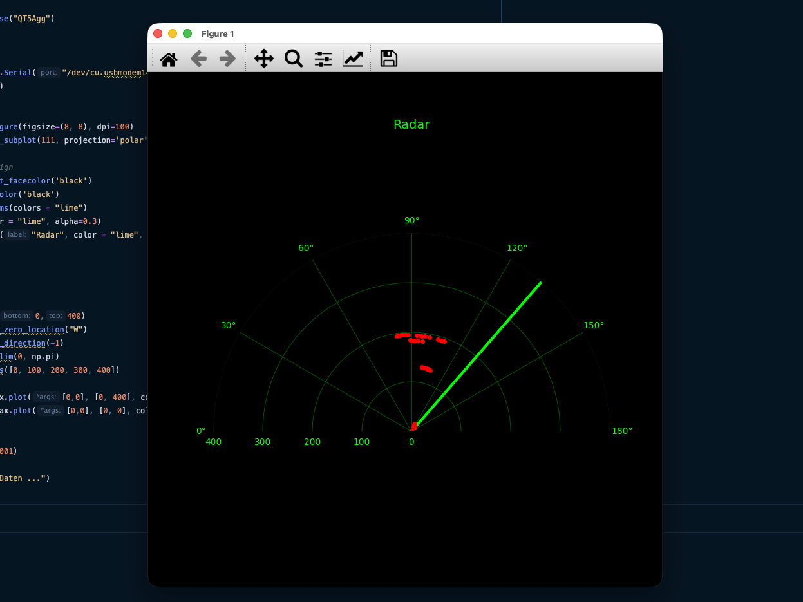
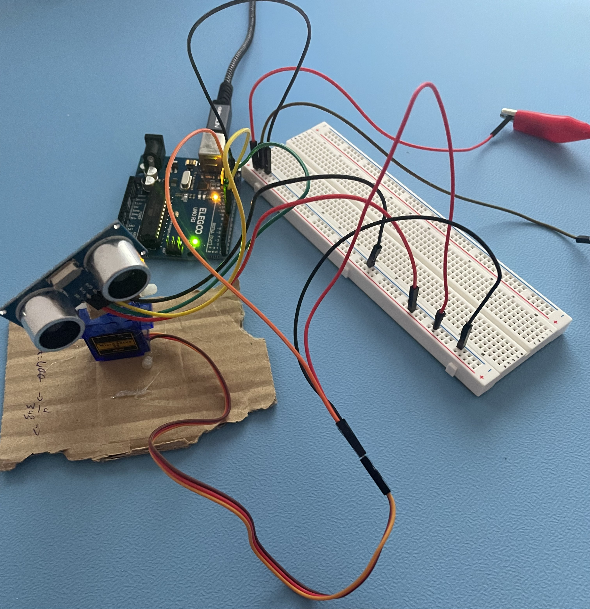

# Radar Scanner

## Fuction 
ultrasonic sensor measures distances and visualizes them in real-time using Python.

## Hardware 
**Microcontgroller:** Arduino clone  
**Sensor:** HC-SR04 Ultrasonic Sensor   
**Actuator:** SG90 Servo Motor   
**Structure:** 3D print  

## Software 
C++  
Python   
**Librarys:** pyserialm matplotlib, Arduino, time, serial,  
**Backend:**  QT5Agg  

## Demo

## Hardware

